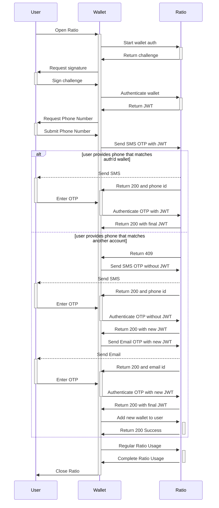

# Account Linking

Occasionally, a user will need to link an existing account to a new signing wallet, for example when using a new wallet app on their phone. The following instructions will help you recognize when and how to attach a new wallet to an existing user.

### New API

We've added an API that allows a two-factor authenticated user to add a wallet address to their profile for future authentication purposes.&#x20;


[https://api.ratio.me/v1/api-docs](https://api.ratio.me/v1/api-docs)



Note: This wallet remains unverified on Ratio's side until a user verifies it by authenticating it. As long as an address is unverified, it can be removed and added to another user. This is to make sure one cannot simply squat on other users' wallet addresses and block them from signing up.


### Scenarios

#### Existing Authentication Factor First

If you use any existing authentication factor before trying to authenticate the new wallet, for example, email or SMS, and then you use that JWT with a subsequent call to authenticate a wallet, we will automatically link that user's account with the new signing wallet.

#### New Wallet First

In this likely scenario, where your app performs wallet signing first and then follows up with an SMS or Email OTP, you will encounter errors during authentication if it's a new wallet for an existing user. This is because when the new wallet is authenticated, it is seen as an entirely new user, however when presented with the phone number, it encounters a collision as the user already has an account with that number. The following steps can help you resolve this:

1. User performs crypto wallet authentication with their new wallet, wherein you call `auth/cryptoWallet:start` and `auth/cryptoWallet:authenticate` as you would in a normal flow. Ratio will return a JWT after a successful wallet signing
2. Request user to perform an SMS OTP for a second authentication factor, requiring them to enter their phone number as you would not receive a `userMask` in the response.
   * The lack of a `userMask` in the response is an indicator that, to Ratio, the user session we've authenticated with that JWT is for a new user.
3. In this case, because the phone number is owned by another account, Ratio will return a `409` due to a phone number conflict.\
   In this scenario, you can handle this error as it best fits your experience. However, if the user does in fact own that phone number, they would likely want to attach that wallet to their profile.
4. Call the `auth/otp/sms:send` endpoint once again, but do not include the JWT from the wallet authentication. This now acts as if SMS is the first authentication factor.
   * You may receive a `429` here, as the authentication service may view this as suspicious. If you do, perform an exponential back-off when sending the OTP.
5. Authenticate the user's OTP as usual with `auth/otp/sms:authenticate` and receive a new `JWT`.
6. Now we still need a second authentication factor, we recommend using Email OTP here by calling `auth/otp/email:send` with the new JWT. We present this to the user as a step to ensure their identification in order to add a new wallet.
7. Authenticate the email's OTP with `auth/otp/email:authenticate` with the JWT you received from the SMS auth and receive a new two-factor JWT.
8. Now, if we wish to attach that wallet address to this user, now that they have an authenticated two-factor session, you may call the `auth/cryptoWallet:addToUser` endpoint with the wallet address. A `200` here indicates that the wallet has been successfully added to the user and can be used in the future.

**Diagram**

