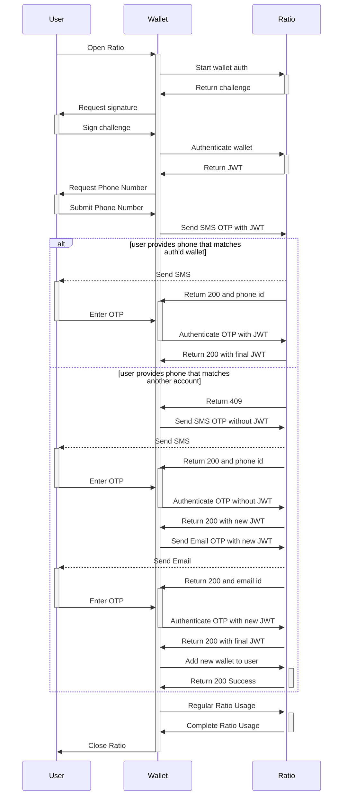

# Link a new Signing Wallet to an Existing User

The atomic unit of our platform is the user. When a user account is created it can used across the entire Ratio network. If you are using a signing wallet as the first authentication factor you will need to handle scenarios where the user has an existing account, but because the new wallet is not mapped to the user, you must use SMS OTP and Email OTP to authenticate the user session.  Once that is done, you will be able to request a challenge and link the new signing wallet.

### Scenarios

#### SMS and Email First

If you already know that the user has a Ratio account and wants to link a signing wallet, then use SMS OTP and email OTP to authenticate the user. Then, use the JWT to request a challenge and sign with the new wallet. We will automatically link the new signing wallet to the user's Ratio account. The new wallet is now stored as an authentication method.

#### New Signing Wallet First

The most likely account linking scenario is when a user session is created with a new wallet. The new wallet looks like a new user and so when the returning user submits their phone  number for SMS OTP verification, our system returns an error (ALREADY\_EXISTS\_PHONE).

Here is the best method to handle the error, authenticate the user account, and link the new signing wallet as an authentication method on the user account:

1. User authenticates with their new wallet, wherein you call `auth/cryptoWallet:start` and `auth/cryptoWallet:authenticate` as you would in a normal flow. Ratio will return a JWT after a successful wallet signing
   * The lack of a `userMask` in the response is an indicator that, to Ratio, the user session associated with that JWT is for a new user
2. User inputs their phone number to receive an SMS OTP code. &#x20;
3. Because the phone number is owned by another account, Ratio will return a `409` with error code (ALREADY\_EXISTS\_PHONE)
4. Call the `auth/otp/sms:send` endpoint once again, but do not include the JWT from the wallet authentication. This now acts as if SMS is the first authentication factor.
   * You may receive a `429` here, as the authentication service may view this as suspicious. If you do, perform an exponential back-off when sending the OTP.
5. Authenticate the user using SMS OTP as usual with `auth/otp/sms:authenticate` and receive a new `JWT`. We have now succesfully identified the user account and you can proceed with Email OTP as their second authentication factor
6. Call `auth/otp/email:send` with the `JWT` you received after the succesfull SMS OTP verification
7. Authenticate the Email OTP with `auth/otp/email:authenticate` and you will receive a new `JWT`for the fully authenticated user session.
8. Attach the new signing wallet address to the user account by calling `auth/cryptoWallet:addToUser` with the wallet address. A `200` here indicates that the wallet has been successfully added to the user and can be used as an authentication method in the future.


[https://api.ratio.me/v1/api-docs](https://api.ratio.me/v1/api-docs)


**Diagram**

