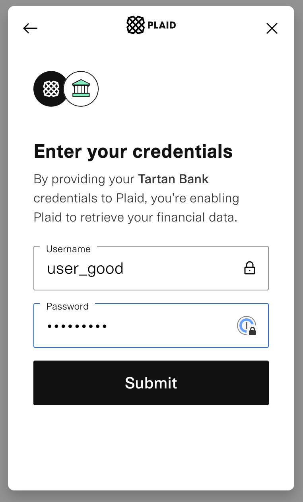

# Testing in Staging

We have a staging environment that can be used for you to perform integration testing. In this environment, you can test an entire end-to-end flow including authentication, identity, bank linking, establishing transaction limits, and buying crypto.

Reach out to the Ratio team for credentials in order to test in Staging.

Staging URL: [https://api.staging.ratio.me/](https://api.staging.ratio.me/)


A new Sandbox environment is launching in April 2023.  It will include test data for more scenarios, as well as support for testnet's on all of our supported networks.


## Test Data

Our staging environment is integrated with our partners' testing environments, such as [`Plaid's Sandbox`](https://plaid.com/docs/sandbox/) environment. As such, it is important that if you wish to do any user creation or bank account, you use the following data.

### **User Authentication and Signup**

Requires a unique wallet address, email, and phone number. &#x20;

### Identity

Use the following information in order to successfully create an account.

* First Name: Alberta
* Middle Name: Bobbeth
* Last Name: Charleson
* SSN: Any SSN starting with 2 through 9 will be approved
* Address:&#x20;
  * City: San Matias
  * Country: US
  * Postal Code: 93405-2255
  * Region: CA
  * Street: 2493 Leisure Lane

### Bank Linking

Use the following to successfully link a bank account

* Bank Name: Tartan Bank
* User Name: `user_good`
* Password: `pass_good`
* Account: Recommend using **Plaid Checking**

``.png>)``.png>)``

``.png>)``.png>)``

Once the bank account is linked, you will see a message that you are approved for an instant limit.

### Buy Crypto

In staging you can simulate crypto purchases from the bank account you linked above. This does not move real fiat currency.  For now, we have also faked the crypto purchase data (asset price, as well as the on-chain transaction).  Everything else that you see in this environment behaves like our production environment; including transaction limits and error handling.
